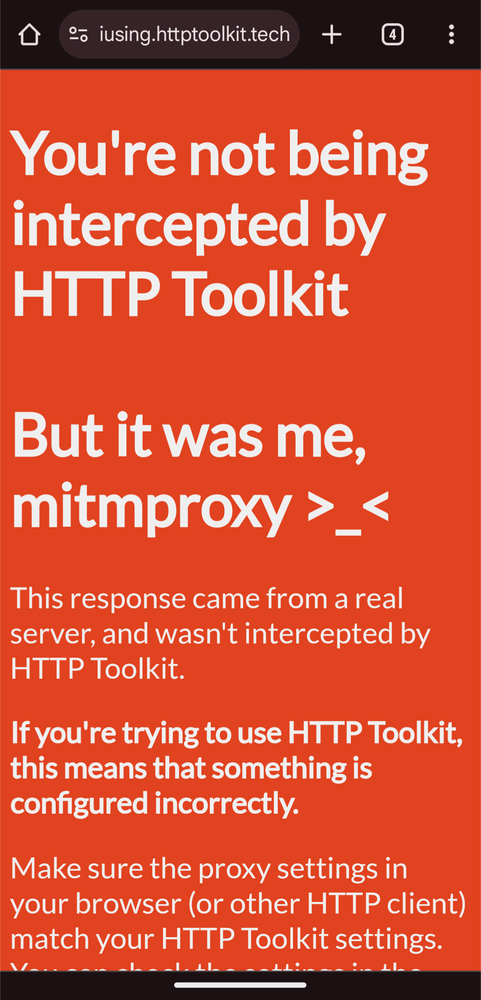

# HTTP Toolkit <--> mitmproxy bridge

The [HTTP Toolkit Android app](https://httptoolkit.com/docs/guides/android/) is a powerful tool in a reverse engineers'
toolbox to intercept, inspect, and modify HTTP(S) traffic on Android devices.
However, HTTP Toolkit for desktop - which the app connects to - is not as feature-rich
as [mitmproxy](https://mitmproxy.org/), another popular open-source interactive HTTPS proxy.
This project aims to bridge the gap between the two tools by allowing the HTTP Toolkit app to use mitmproxy as a proxy
server instead.

If you don't use the HTTP Toolkit app you should consider setting up a [wireguard](https://mitmproxy.org/posts/wireguard-mode/) connection with mitmproxy instead.  

## Usage

1. Download the mitmproxy addon directly from this repository or clone the repository:

```bash
$ git clone https://github.com/sleeyax/http-toolkit-mitmproxy-bridge.git
$ cd http-toolkit-mitmproxy-bridge
```

2. Start mitmproxy with the addon enabled:

```bash
$ mitmproxy --ssl-insecure -s addon.py
```

3. Check the events tab (`E`, `shift + e`) and copy the generated QR code link. Example output (redacted for privacy):

```
info: [03:28:08.853] Loading script ./addon.py
info: [03:28:08.864] http-toolkit-mitmproxy-bridge: config: {"addresses": ["x.x.x.x", "y.y.y.y"], "port": 8888, "certFingerprint": "U112DduSTKgpntGPtEmV40Rq5/5G8hqqlk6eHqzmYx8="}
info: [03:28:08.864] http-toolkit-mitmproxy-bridge: QR code link: https://api.qrserver.com/v1/create-qr-code/?size=150x150&data=https://android.httptoolkit.tech/connect/?data=eyJhZGRyZXNzZXMiOiBbIngueC54LngiLCAieS55LnkueSJdLCAicG9ydCI6IDg4ODgsICJjZXJ0RmluZ2VycHJpbnQiOiAiVTExMkRkdVNUS2dwbnRHUHRFbVY0MFJxNS81RzhocXFsazZlSHF6bVl4OD0ifQ==
```

**Make sure you copy the whole link!** The base64 encoded chunk at the end may become quite large depending on
your system configuration.

4. Open the QR code in your browser and scan it with the HTTP Toolkit app. You may need to zoom in your browser window a
   bit for the app to recognize the QR code.
5. The app should now be connected to mitmproxy
   and you can start intercepting traffic as usual.

<details><summary>Click to see screenshot</summary>
   
</details>

## Troubleshooting

This addon was built in a hurry and the initial goal was to get it working on *my machine* (linux dekstop). It may or
may not work on yours (Windows machines need WSL most likely), there's no guarantee nor support from me. If you need a
feature, or wish
to add support for your operating system, contribute by creating a Pull Request!

In any case, if something isn't working as expected you should start by checking the mitmproxy event log to figure out
what went
wrong.
